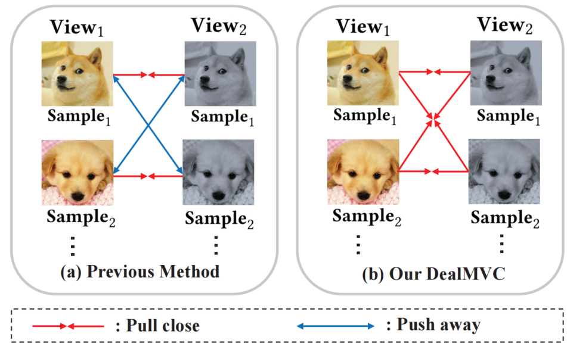
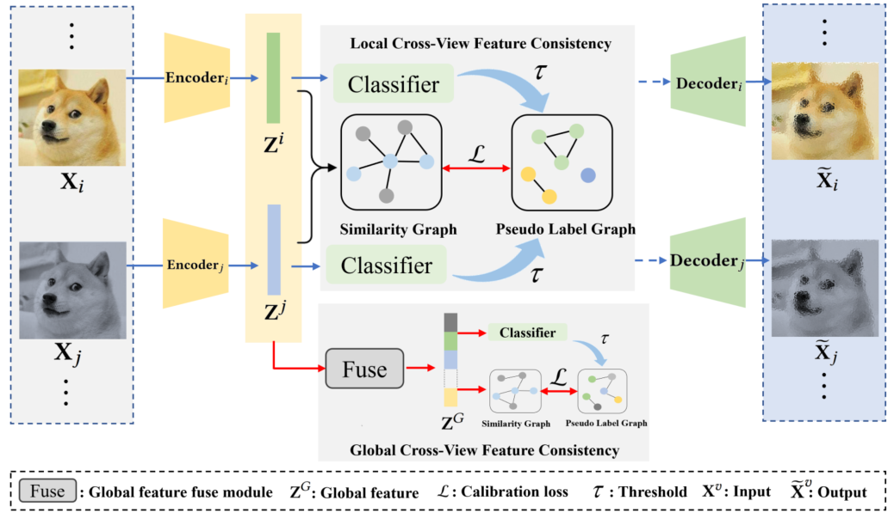
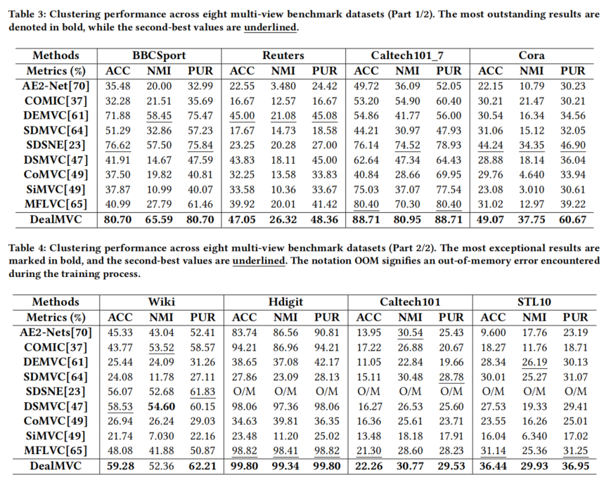

[stars-img]: https://img.shields.io/github/stars/xihongyang1999/DealMVC?color=yellow
[stars-url]: https://github.com/xihongyang1999/DealMVC/stargazers
[fork-img]: https://img.shields.io/github/forks/xihongyang1999/DealMVC?color=lightblue&label=fork
[fork-url]: https://github.com/xihongyang1999/DealMVC/network/members
[visitors-img]: https://visitor-badge.glitch.me/badge?page_id=xihongyang1999/DealMVC/
[adgc-url]: https://github.com/xihongyang1999/DealMVC

# DealMVC: Dual Contrastive Calibration for Multi-view Clustering

<p align="center">   
    <a href="https://pytorch.org/" alt="PyTorch">
      </a>
    <a href="https://www.acmmm2023.org" alt="Conference">
        </a>
<p/>


[![GitHub stars][stars-img]][stars-url]
[![GitHub forks][fork-img]][fork-url]


An official source code for paper DealMVC: Dual Contrastive Calibration for Multi-view Clustering, accepted by ACM MM 23. Any communications or issues are welcomed. Please contact xihong_edu@163.com. If you find this repository useful to your research or work, it is really appreciate to star this repository. :heart:

-------------

### Motivation

<p align = "justify"> 
 Illustration of the motivation of DealMVC. 
</p>
<div  align="center">    
    
</div>


### Overview

<p align = "justify"> 
 Illustration of DealMVC: Dual Contrastive Calibration for Multi-view Clustering mechanism. 
</p>
<div  align="center">    
    
</div>


### Results

<p align = "justify"> 
The performance of our proposed DealMVC in eight datasets. 
</p>
<div  align="center">    
    
</div>


### Requirements

The proposed DealMVC is implemented with python 3.8.8 on a NVIDIA 1080 Ti GPU. 

Python package information is summarized in **requirements.txt**:

- torch==1.8.0
- tqdm==4.61.2
- numpy==1.21.0
- tensorboard==2.8.0


### Quick Verification

```
python test.py 
```


### Citation

If you use code or datasets in this repository for your research, please cite our paper.

```
@inproceedings{DealMVC,
  title={Dealmvc: Dual contrastive calibration for multi-view clustering},
  author={Yang, Xihong and Jiaqi, Jin and Wang, Siwei and Liang, Ke and Liu, Yue and Wen, Yi and Liu, Suyuan and Zhou, Sihang and Liu, Xinwang and Zhu, En},
  booktitle={Proceedings of the 31st ACM International Conference on Multimedia},
  pages={337--346},
  year={2023}
}
```


